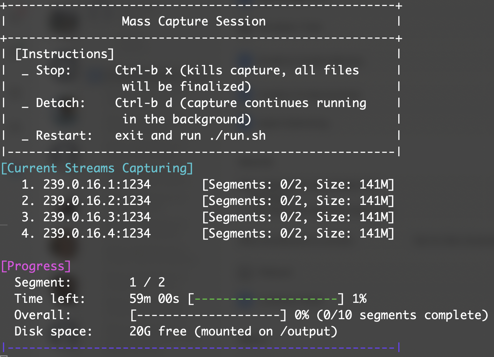

# Mass Capture System

## Quick Start (Ubuntu, Docker required)

You can install and set up everything in one step (no git required):

```sh
bash <(curl -fsSL https://raw.githubusercontent.com/ingvarpetrov/udp-capture/main/quickstart.sh)
```

- This will download the project, build the Docker image, and print next steps.
- **Note:** This script is for Ubuntu systems and assumes Docker is already installed.

## Screenshot



## Overview
This system captures multiple UDP streams into segmented .ts files using tsduck, running inside Docker and managed via tmux.

## Configuration
Edit `capture.cfg` to set your parameters:

```
output_folder=./output
parallel_streams=4
segment_length_hours=1
total_segments=24
# Optional: set the IP address of the interface to use for multicast capture
# interface_ip=192.168.1.100

udp_streams:
239.0.0.1:1234
239.0.0.2:1234
239.0.0.3:1234
239.0.0.4:1234
239.0.0.5:1234
```

- `output_folder`: Where to save captured files (relative to project root)
- `parallel_streams`: How many streams to capture at once
- `segment_length_hours`: Length of each segment in hours
- `total_segments`: How many segments to capture
- `interface_ip`: (Optional) IP address of the interface to use for multicast capture
- `udp_streams`: List of UDP streams, one per line after `udp_streams:`

## Build and Run

1. **Build the Docker image:**
   ```
   ./install.sh
   ```
2. **Start the capture process (container and tmux session):**
   ```
   ./run.sh
   ```
   This will start the container (if not already running) and launch the capture script in a tmux session inside the container.

3. **Monitor the capture session in tmux:**
   ```
   ./monitor.sh
   ```
   This will attach to the tmux session inside the running container for live monitoring.

## Tmux Interface
- **Stop:** `ctrl-b x`
- **Detach:** `ctrl-b d`
- **Restart:** Exit and run `./run.sh` again
- The tmux pane will show:
  - Instructions
  - Which channels are being captured
  - Time left for current segment
  - Disk space left
  - Per-stream and overall progress

## Notes
- All files (output, config, scripts) are mounted as volumes and owned by the host user.
- Uses an older, stable version of tsduck for compatibility.
- Everything is configurable via `capture.cfg`.

## Testing a UDP Stream

You can use the provided `test.sh` script to check if a UDP stream is reachable and can be captured:

```
./test.sh 239.0.0.1:1234
```

This will attempt to capture a short sample and report success or failure.

## Troubleshooting

### Multicast Routing
If you cannot receive multicast traffic, you may need to add a multicast route. For example:

```
sudo route add -net 224.0.0.0 netmask 240.0.0.0 eth0
```
Replace `eth0` with the correct interface name.

### Disabling Reverse Path Filtering (rp_filter)
Reverse path filtering can block multicast. To disable it:

```
sudo sysctl -w net.ipv4.conf.all.rp_filter=0
sudo sysctl -w net.ipv4.conf.default.rp_filter=0
sudo sysctl -w net.ipv4.conf.eth0.rp_filter=0
```
Replace `eth0` with your interface if needed.

### General Tips
- Ensure your Docker container is running with `--network host` and `--privileged`.
- Check that your interface is up and has the correct IP address.
- Use `./test.sh` to verify stream reachability before starting a full capture.

## Screenshot

 